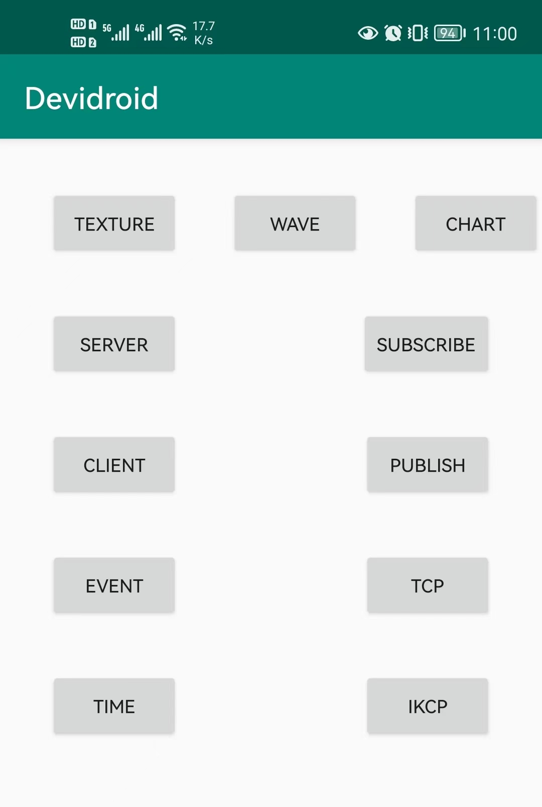

# Devidroid
### An Android test application.
-------
#### Functions of buttons: 
- TEXTURE

    a test page for image/video `encode/decode` include `CPU/GPU` render, `OpenGL` render
- WAVE

    to record sounds and draw waves
- CHART

    a line chart using `com.github.PhilJay:MPAndroidChart:v3.0.1`
- SERVER

    click to start a udp server

- CLIENT

    click to start a udp client

- SUBSCRIBE

    click to open `float window` setting server ip/port and topic to subscribe message from `broker`, receiving data set to a `TextView` below

- PUBLISH

    click to open `float window` setting payload/topic send to subscriber by `broker`

- TCP

    click to start a tcp server to receive data

- IKCP

    a test case for `kcp`

- EVENT

    click to update event value

- TIME

    click to update timestamp

    
