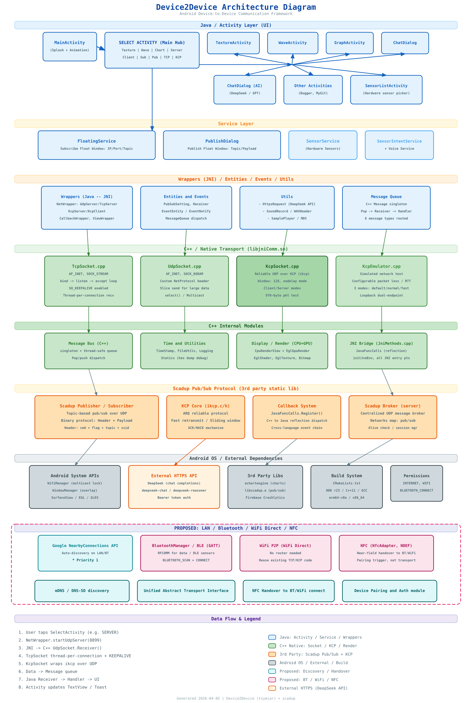
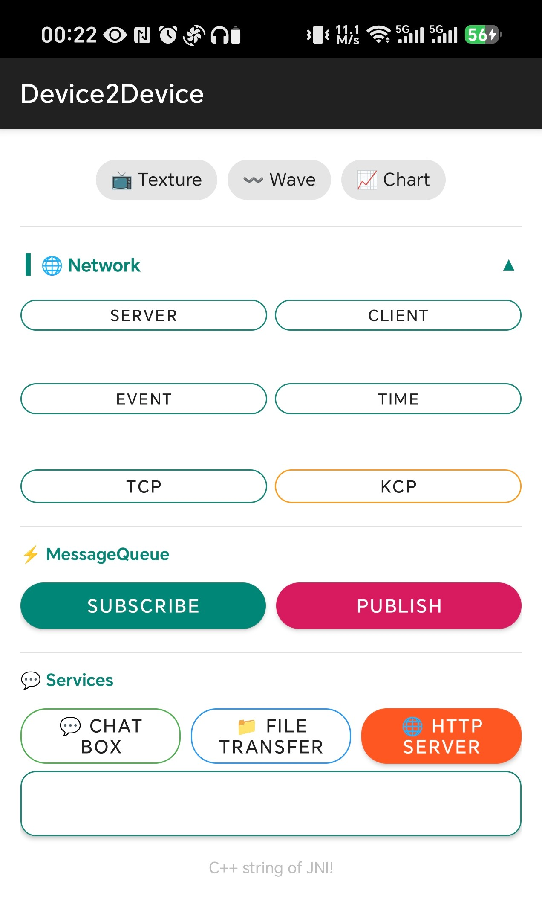

[](https://tsymiar.visualstudio.com/MyAutomatic/_build/latest?definitionId=72&repoName=tsymiar%2FDevice2Device&branchName=main)
[](https://www.codacy.com/gh/tsymiar/Device2Device/dashboard?utm_source=github.com&amp;utm_medium=referral&amp;utm_content=tsymiar/Device2Device&amp;utm_campaign=Badge_Grade)

# Device2Device

An Android application for peer-to-peer communication between devices.

---

## Architecture



---

### Technology Stack

| Category | Technologies |
| :------ | :----------- |
| Platform | Android (API 21+) |
| Language | Java, Kotlin, C++ |
| Native | JNI, CMake, OpenGL ES |
| Network | UDP, TCP, KCP |
| Media | Audio Recording, Video Encode/Decode |
| Build | Gradle, CMake, NDK |

---

### Project Structure

```
app/src/main/
├── java/com/tsymiar/device2device/
│   ├── activity/             # Activity components
│   │   ├── MainActivity      # Main entry point
│   │   ├── TextureActivity   # Image/Video encode/decode
│   │   ├── WaveActivity      # Audio recording & waveform
│   │   └── GraphActivity     # Sensor chart display
│   ├── service/              # Background services
│   │   ├── FloatingService   # Floating window
│   │   └── PublishDialog     # Message publishing
│   ├── acceleration/         # Sensor & Voice modules
│   │   ├── Sensor/           # Sensor data collection
│   │   └── Voice/            # Voice processing
│   ├── dialog/               # UI dialogs
│   ├── entity/               # Data entities
│   ├── event/                # Event handling
│   ├── utils/                # Utilities
│   ├── view/                 # Custom views
│   └── wrapper/              # Native bridge wrappers
├── cpp/                      # Native C++ code
│   ├── bitmap/               # Bitmap processing
│   ├── callback/             # JNI callbacks
│   ├── convert/              # PCM↔WAV, YUV↔RGB
│   ├── display/              # Display rendering
│   ├── message/              # Message queue
│   ├── socket/               # UDP/TCP/KCP sockets
│   ├── scadup/               # Message queue lib
│   └── time/                 # Time utilities
└── res/                      # Android resources
```

---

## Features

### Multimedia Processing

| Feature | Description |
| :----- | :---------- |
| TEXTURE | Image/Video encode/decode test with CPU/GPU rendering and OpenGL |
| WAVE | Record audio and draw real-time waveforms |
| CHART | Display sensor data in line charts |

### Network Communication

| Feature | Description |
| :----- | :---------- |
| SERVER | Start a UDP server to receive data |
| CLIENT | Start a UDP client to send data |
| TCP | Start a TCP server to receive data |
| KCP | Test KCP (Reliable UDP) protocol |
| SUBSCRIBE | Subscribe to messages from broker via float window |
| PUBLISH | Publish messages to subscribers via broker |

### System Integration

| Feature | Description |
| :----- | :---------- |
| EVENT | Update and broadcast event values |
| TIME | Update and synchronize timestamps |

---

## Build Requirements

- Android SDK 31
- Android NDK 23.0.7599858
- Build Tools 30.0.3
- Gradle 7.x
- CMake 3.18+

---

## Permissions

```xml
android.permission.BLUETOOTH_CONNECT
android.permission.WRITE_EXTERNAL_STORAGE
android.permission.READ_EXTERNAL_STORAGE
android.permission.RECORD_AUDIO
android.permission.INTERNET
android.permission.ACCESS_WIFI_STATE
android.permission.CHANGE_WIFI_MULTICAST_STATE
android.permission.SYSTEM_ALERT_WINDOW
android.permission.ACCESS_NETWORK_STATE
android.permission.READ_PHONE_STATE
android.permission.HIGH_SAMPLING_RATE_SENSORS
```

---

## Building

```bash
./gradlew assembleDebug
# or
./build.sh
```

---

## Screenshot



---

## License

MIT License
