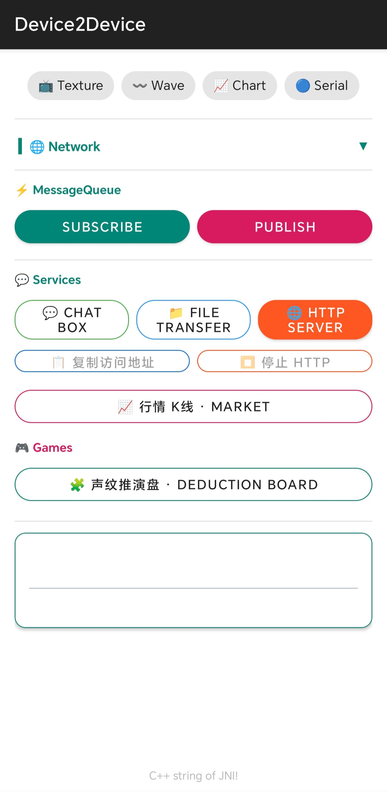

[](https://tsymiar.visualstudio.com/MyAutomatic/_build/latest?definitionId=72&repoName=tsymiar%2FDevice2Device&branchName=main)
[](https://app.codacy.com/gh/tsymiar/Device2Device/dashboard?utm_source=gh&utm_medium=referral&utm_content=&utm_campaign=Badge_grade)

# Device2Device

A feature-rich Android application for **peer-to-peer communication** and **multimedia processing** between devices.

**Core capabilities:**
- 🔵 Bluetooth RFCOMM serial communication with device discovery and data logging
- 🌐 Multi-protocol networking: TCP, UDP (multicast), KCP (reliable UDP)
- 📨 Pub/Sub messaging via scadup message queue library
- 🎨 GPU (OpenGL ES) and CPU image/video rendering
- 🎤 Audio recording (16kHz PCM) with real-time waveform visualization and speech recognition
- 📊 Real-time sensor monitoring (accelerometer, gravity, linear acceleration)
- 🤖 AI chat powered by DeepSeek API (Chat + Deep Think models)
- 📁 Embedded HTTP file server with directory browsing

---

## Architecture


---

### Technology Stack

| Category    | Technologies                                              |
| :---------- | :-------------------------------------------------------- |
| Platform    | Android (API 21+, target 31)                              |
| Language    | Java, C++ (C++11)                                        |
| Native      | JNI, CMake 2.8+, OpenGL ES 2.0, OpenSL ES, NDK 23       |
| Network     | UDP (Multicast), TCP, KCP (Reliable UDP), HTTP, Bluetooth |
| Media       | AudioRecord, AudioTrack, MediaExtractor, OpenGL ES, YUV↔RGB, PCM↔WAV |
| UI          | Material Design, ConstraintLayout, Custom Views, System Overlay |
| Build       | Gradle 7.x, CMake, NDK (ARM NEON optimizations)           |

---

### Project Structure

```
app/src/main/
├── java/com/tsymiar/device2device/
│   ├── activity/                  # Activities (12)
│   │   ├── MainActivity           # Splash screen → auto-navigate
│   │   ├── SelectActivity         # Main dashboard (network, sensor, chat, files, Bluetooth)
│   │   ├── TextureActivity        # Image/Video GPU & CPU rendering
│   │   ├── WaveActivity           # Audio recording & real-time waveform + speech recognition
│   │   ├── GraphActivity          # Sensor real-time data display
│   │   ├── SensorActivity         # List all device sensors
│   │   ├── CommitActivity         # Bluetooth serial communication (RFCOMM)
│   │   ├── ConnectActivity        # Bluetooth discoverability & device scanning
│   │   ├── DevicesActivity        # Paired & discovered Bluetooth devices list
│   │   ├── BuggerActivity         # Bug report / email feedback
│   │   ├── MyGitActivity          # Open project GitHub page
│   │   └── ThanksActivity         # Acknowledgements page
│   ├── service/                   # Background services (7)
│   │   ├── SubscribeService       # Pub/Sub subscribe floating window
│   │   ├── PublishService         # Pub/Sub publish floating window
│   │   ├── HttpFileService        # Embedded HTTP file server (File & SAF modes)
│   │   ├── ToastNotificationService  # Global floating toast notifications
│   │   ├── ReceiverService        # Bluetooth data receive floating window
│   │   ├── WindowService          # Generic text overlay floating window
│   │   ├── SaveDataService        # Persist Bluetooth received data to file
│   │   └── Voice                  # Audio alert playback service
│   ├── acceleration/              # Sensor & Voice modules
│   │   ├── SensorFragment         # Real-time accelerometer chart (Bézier-smoothed)
│   │   ├── DefaultFragment        # Basic sensor chart variant
│   │   └── Voice                  # Over-acceleration warning (threshold: 7.0 m/s²)
│   ├── dialog/                    # UI dialogs
│   │   ├── ChatBoxDialog          # DeepSeek AI chat (Chat / Reasoner models)
│   │   └── FileMsgDialog          # File transfer with progress & SAF file picker
│   ├── entity/                    # Data entities (PubSubSetting, Receiver)
│   ├── event/                     # Observer-pattern event system (EventHandle, EventNotify)
│   ├── utils/                     # Utilities (Atom, MP4Header, WAVHeader, SoundRecord, WaveCanvas, HttpsRequest, Utils, etc.)
│   ├── view/                      # Custom views (WaveSurface, WaveformsView)
│   └── wrapper/                   # JNI native bridge (Callback, Network, View, Media, Time)
├── cpp/                           # Native C++ code
│   ├── JniMethods.cpp/h           # All JNI entry points
│   ├── bitmap/                    # BMP image processing
│   ├── callback/                  # Java↔C++ bidirectional callbacks
│   ├── convert/                   # PCM↔WAV, YUV↔RGB format conversion
│   ├── display/                   # GPU (EGL/GLES2) & CPU rendering
│   ├── message/                   # Thread-safe message queue
│   ├── socket/                    # UDP / TCP / KCP / FileMsg protocol
│   ├── scadup/                    # Message queue library (tsymiar/scadup)
│   ├── test/                      # Unit tests (FileMsgSocket)
│   ├── time/                      # Timestamp utilities
│   └── utils/                     # File utilities, logging, constants
```

---

## Features

### Bluetooth Communication

| Feature        | Description                                                          |
| :------------- | :------------------------------------------------------------------- |
| Device Scanning | Scan for nearby Bluetooth devices                                    |
| Pairing         | List paired devices and discover new ones                            |
| Serial Comm     | Bidirectional RFCOMM communication with directional control commands |
| Data Logging    | Auto-save received data to local file                                |
| Floating Window | Receive data display in draggable system overlay                     |

### Network Communication

| Feature     | Description                                                     |
| :---------- | :--------------------------------------------------------------- |
| UDP Server  | Start a UDP multicast server to receive data                     |
| UDP Client  | Start a UDP multicast client to send data                        |
| TCP Server  | Start a TCP server to receive data                               |
| KCP         | KCP (Reliable UDP) protocol for low-latency transmission         |
| Pub/Sub     | Subscribe & Publish messages via floating dialog windows; async connection with real-time status feedback |
| File Transfer | Custom binary protocol with chunked transfer (64KB/chunk) and progress callback |
| HTTP Server | Embedded HTTP server with HTML directory listing; supports SAF mode (Android 10+) |

### Message System (C++ ↔ Java)

The app uses a thread-safe message queue (`Message.h`) to bridge C++ native code with Java UI. Messages are dispatched via the `MASSAGER` enum:

| Type          | Direction | Description                               |
| :------------ | :-------: | :---------------------------------------- |
| `MESSAGE`     | C++ → Java | General toast notifications               |
| `TOAST`       | C++ → Java | Status text update (`txt_status`)         |
| `MSG_HINT`    | C++ → Java | Hint text update (`txt_hint`)             |
| `SUBSCRIBER`  | C++ → Java | Subscribe service feedback                |
| `PUBLISHER`   | C++ → Java | Publish service feedback                  |
| `FILE_PROGRESS` | C++ → Java | File transfer progress update             |
| `TEXTURE`     | C++ → Java | Texture rendering callback                |
| `UDP_SERVER`  | C++ → Java | UDP server status                         |
| `UDP_CLIENT`  | C++ → Java | UDP client status                         |
| `KCP_VIEW`    | C++ → Java | KCP connection status                     |

The SelectActivity UI features a dual-status display: `txt_hint` (italic, light gray) for supplementary hints and `txt_status` (bold, dark) for primary status, separated by a divider line.

### Multimedia Processing

| Feature        | Description                                                            |
| :------------- | :--------------------------------------------------------------------- |
| GPU Rendering  | Image/video rendering via OpenGL ES 2.0 (EGL/GLESv2)                  |
| CPU Rendering  | Software-based image/video decoding and display                        |
| Audio Recording | 16kHz PCM recording with real-time waveform visualization              |
| Audio Playback  | Play WAV/MP4/OGG/MP3/AAC/AMR files with waveform analysis              |
| Speech to Text  | Built-in speech recognition (STT) integration                          |
| Sensor Monitor  | Real-time accelerometer, gravity, and linear acceleration data display |

### Intelligent Features

| Feature      | Description                                                        |
| :----------- | :------------------------------------------------------------------ |
| AI Chat      | DeepSeek API integration with Chat / Reasoner (Deep Think) models   |
| Sensor Alert | Automatic warning audio when acceleration exceeds 7.0 m/s² threshold |

### System Integration

| Feature       | Description                                                    |
| :------------ | :-------------------------------------------------------------- |
| Event System  | Observer-pattern event broadcast for inter-component communication |
| Time Sync     | Native timestamp acquisition and synchronization                |
| Global Toast  | Floating toast notification service (3s auto-dismiss)            |
| One-Tap Exit | Global exit manager to terminate all activities and services     |

---

## Build Requirements

| Component      | Version                          |
| :------------- | :------------------------------- |
| Android SDK    | 31 (compileSdk) / 21+ (minSdk)  |
| Android NDK    | 23.0.7599858                     |
| Build Tools    | 30.0.3                           |
| Gradle         | 7.x                              |
| CMake          | 2.8+                             |
| JDK            | 8 or 11                          |
| ABIs           | arm64-v8a, armeabi-v7a, x86_64   |
| C++ Standard   | C++11 (ARM NEON optimized)       |

---

## Permissions

```xml
<uses-permission android:name="android.permission.BLUETOOTH" />
<uses-permission android:name="android.permission.BLUETOOTH_ADMIN" />
<uses-permission android:name="android.permission.BLUETOOTH_CONNECT" />
<uses-permission android:name="android.permission.BLUETOOTH_SCAN" />
<uses-permission android:name="android.permission.WRITE_EXTERNAL_STORAGE" />
<uses-permission android:name="android.permission.READ_EXTERNAL_STORAGE" />
<uses-permission android:name="android.permission.RECORD_AUDIO" />
<uses-permission android:name="android.permission.INTERNET" />
<uses-permission android:name="android.permission.ACCESS_WIFI_STATE" />
<uses-permission android:name="android.permission.CHANGE_WIFI_MULTICAST_STATE" />
<uses-permission android:name="android.permission.SYSTEM_ALERT_WINDOW" />
<uses-permission android:name="android.permission.ACCESS_NETWORK_STATE" />
<uses-permission android:name="android.permission.READ_PHONE_STATE" />
<uses-permission android:name="android.permission.HIGH_SAMPLING_RATE_SENSORS" />
```

---

## Building

```bash
# Local build
./build.sh

# CI build (Azure Pipelines)
# See azure-pipelines.yml
```

---

## CI/CD

This project uses Azure Pipelines for continuous integration on `macos-latest`. The pipeline:

- Checks out the main repo and `tsymiar/scadup` submodule
- Copies scadup native library to `app/src/main/cpp/scadup/`
- Installs Android SDK components (NDK 23, build-tools 30.0.3, platform 31)
- Sets up JDK 11 and builds with Gradle 7.0.2
- Produces debug APK for `arm64-v8a`, `armeabi-v7a`, `x86_64`

---

## Screenshots



---

## License

MIT License

---

## Recent Changes

### 2026-06

- **MSG_HINT Message Type**: Added `MSG_HINT = 9` to `MASSAGER` enum for displaying auxiliary hint text in `SelectActivity`. C++ can now send hints via `Message::instance().setMessage(msg, MSG_HINT)`.
- **UI Layout Improvements**: `sample_text` moved to fixed footer (outside `ScrollView`). `txt_hint` added above `txt_status` with visual differentiation: italic 12sp gray hint vs. bold 14sp dark status, separated by a divider line.
- **Pub/Sub Async Overhaul** (`JniMethods.cpp`): `StartSubscribe` now returns immediately (non-blocking), connection results sent asynchronously via Message system. `Publish` moved to detached thread to prevent UI thread blocking (ANR). Added real-time feedback (Toast) for both Subscribe and Publish operations.
- **Publish/Subscribe Topic Isolation** (`PubSubSetting.java`): Separate `topic` (subscribe) and `pubTopic` (publish) fields to prevent cross-contamination between services.
- **Subscriber Use-After-Free Fix** (`Subscriber.cpp`): Fixed random trailing characters in received messages. Root cause: `body` buffer was freed immediately after enqueuing callback to thread pool, but the callback's `content` pointer still referenced freed memory. Fixed by using `shared_ptr<vector<char>>` to manage buffer lifecycle, ensuring it persists until callback completion.
- **Port Parsing Protection** (`SubscribeService.java`): Added `try-catch` around `Integer.parseInt()` calls for port input, falling back to default port 9999 on invalid input.
