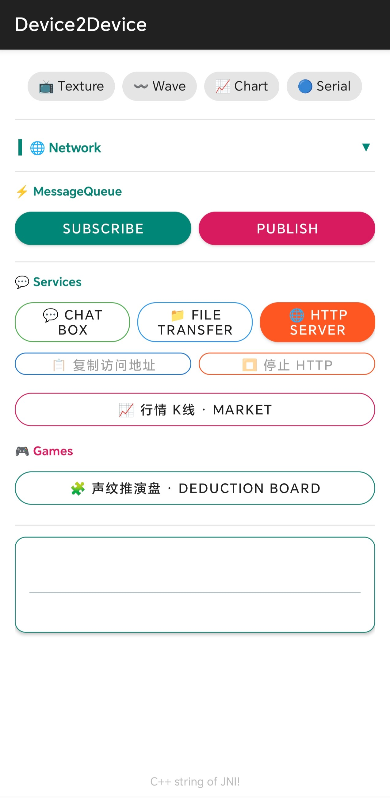

[](https://tsymiar.visualstudio.com/MyAutomatic/_build/latest?definitionId=72&repoName=tsymiar%2FDevice2Device&branchName=main)
[](https://app.codacy.com/gh/tsymiar/Device2Device/dashboard?utm_source=gh&utm_medium=referral&utm_content=&utm_campaign=Badge_grade)

# Device2Device

A feature-rich Android app for **peer-to-peer communication** and **multimedia processing** between devices.

**Core capabilities:** Bluetooth RFCOMM serial · multi-protocol networking (TCP / UDP multicast / KCP) · Pub/Sub messaging · GPU/CPU image & video rendering · audio recording + real-time waveform + STT · real-time sensor dashboard · SSH server · parametric life-size 3D human model · DeepSeek AI chat · market K-line quotes + home widgets · embedded HTTP file server.

---

## Architecture


### Technology Stack

| Category    | Technologies                                              |
| :---------- | :-------------------------------------------------------- |
| Platform    | Android (API 21+, target 31)                              |
| Language    | Java, C++ (C++11)                                        |
| Native      | JNI, CMake 2.8+, OpenGL ES 2.0, OpenSL ES, NDK 23       |
| Network     | UDP (multicast), TCP, KCP, HTTP, Bluetooth                |
| Market Data | Keyless public HTTPS: Tencent, Eastmoney, Sina, Binance, Frankfurter (ECB) |
| Media       | AudioRecord/Track, MediaExtractor, OpenGL ES, YUV↔RGB, PCM↔WAV |
| 3D          | OpenGL ES 2.0 parametric mesh, OBJ/MTL export            |
| UI          | Material Design, ConstraintLayout, custom views, Day/Night |
| Build       | Gradle 7.x, CMake, NDK (ARM NEON)                        |

### Project Structure

```
app/src/main/
├── java/com/tsymiar/device2device/
│   ├── activity/      # 14 Activities: MainActivity, SelectActivity (dashboard),
│   │                 #   Market/Avatar/Texture/Wave/Graph/Sensor, BtRemote/Dialog/Devices,
│   │                 #   Bugger, MyGit, Thanks
│   ├── service/       # 7 services: Subscribe/Publish/HTTP server/Toast/Receiver/Window/SaveData + Voice
│   ├── acceleration/  # Sensor & Voice modules
│   ├── dialog/        # ChatBox (DeepSeek) + FileMsg
│   ├── entity/ event/ # Data entities & observer event system
│   ├── widget/        # MarketWidgetProvider + config, MarketChartWidgetProvider + config
│   ├── market/        # QuoteSource (11 sources), Quote, Indicators
│   ├── avatar/        # BodyProfile, AnnyModel/AnnyTargets/AnnyParams/AnnyMeasure,
│   │                 #   MeshBuilder, HumanMesh, AvatarRenderer/SurfaceView, PhotoAnalyzer
│   ├── utils/         # Utilities (Atom, headers, SoundRecord, HttpsRequest, …)
│   ├── view/          # Custom views (KLineView, WaveSurface, Compass, BubbleLevel, Decibel, …)
│   └── wrapper/       # JNI native bridge (Callback, Network, View, Media, Time)
└── cpp/               # Native: JniMethods, bitmap, callback, convert, display,
                        #   message, socket, scadup (tsymiar/scadup), test, time, utils
```

---

## Features

### Bluetooth
Device scanning & pairing · bidirectional RFCOMM serial with directional commands · auto data logging · draggable floating receive window.

### Networking
UDP/TCP multicast, KCP reliable UDP, Pub/Sub floating dialogs, 64 KB/chunk file transfer with progress, embedded HTTP server (FS & SAF) with sortable listing + in-page viewer, SSH server (Apache MINA SSHD) on port 2222 as a foreground service.

### Market Quotes (K-Line)
`MarketActivity` + `market/` + `KLineView`; keyless public HTTPS; bar fields (`time, open, high, low, close, volume, amount`) match the `matkline.py` toolset.

**Sources (`QuoteSource`):** `auto` (smart pick + fallback), `tencent` (A-shares/indices/funds), `eastmoney` (A-shares/futures/HK), `gold`/`xau`/`gc`, `crude`/`brent`/`ng`, `usd` (USD index), `binance` (crypto). Intervals span 1m…1M per source.

**Features:** code / name / pinyin input with picker · candles + MA5/10/20 + last-price line · indicators (MA / Volume / MACD / RSI / KDJ) · drag-pan, pinch-zoom, crosshair tooltip · 15s auto-refresh · persisted prefs · **home widgets** — `📈 Quotes` (2×2 resizable, per-instance source+symbol) and the `行情曲线` chart widget (single-symbol trend sparkline, resizable, 2×2-friendly; 黄金标的额外标注人民币价 元/克).

### Message System (C++ ↔ Java)
Thread-safe queue (`Message.h`) + `MASSAGER` enum bridging native and UI: toast/status/hint, pub-sub feedback, file progress, texture, UDP server/client, KCP status. `SelectActivity` shows dual status (`txt_hint` / `txt_status`) with day/night-aware colors.

### Multimedia
GPU (EGL/GLES2) & CPU image/video rendering · 16 kHz PCM recording with live waveform · WAV/MP4/OGG/MP3/AAC/AMR playback + waveform · built-in STT.

### 3D Human Model (Avatar)
On-device parametric model (no cloud). A photo contributes appearance + silhouette proportions; the user supplies the absolute scale. Engine picker on entry:

| Engine | Description |
| :----- | :---------- |
| `Native` (原生) | SDF implicit surface + SurfaceNets — fully procedural body & face |
| `High-res` (高分) | **Anny** ([naver/anny](https://github.com/naver/anny), Apache-2.0, MakeHuman/CC0): phenotype params drive prototype blendshapes; baked offline by `tools/export_anny_targets.py` → `anny.mhb`, solved on device as `w = Π c`; falls back to `Native` if missing |

> Regenerate `anny.mhb`: `python3 tools/export_anny_targets.py export --anny-dir /path/to/anny --out app/src/main/assets/anny/anny.mhb` (or `--synthetic` for a placeholder; `selftest` checks byte-exactness). Bakes gender/muscle/weight/height into 56 multi-linear blendshapes.

**Features:** photo / cloud (Tripo3D) input · silhouette & color extraction · body params (gender/height/weight/head ratio + girth tuning) · face shapes & 8 hairstyles · life-size mesh + measurements (BMI, circumferences, inseam) · OpenGL ES preview (grid/ruler/shadow) · OBJ+MTL export & PNG screenshot · persisted prefs.

### Intelligent
DeepSeek AI chat (Chat / Reasoner) · acceleration alert at 7.0 m/s².

### System
Observer event bus · native time sync · global 3s toast · one-tap exit.

---

## Build Requirements

Android SDK 31 / min 21 · NDK 23.0.7599858 · Build Tools 30.0.3 · Gradle 7.x · CMake 2.8+ · JDK 8/11 · ABIs arm64-v8a, armeabi-v7a, x86_64 · C++11 (ARM NEON).

## Permissions

`BLUETOOTH` (+`ADMIN`/`CONNECT`/`SCAN`), `WRITE`/`READ_EXTERNAL_STORAGE`, `CAMERA`, `RECORD_AUDIO`, `INTERNET`, `ACCESS_WIFI_STATE`, `CHANGE_WIFI_MULTICAST_STATE`, `SYSTEM_ALERT_WINDOW`, `ACCESS_NETWORK_STATE`, `READ_PHONE_STATE`, `HIGH_SAMPLING_RATE_SENSORS`.

## Building

`./build.sh` (local). Azure Pipelines CI on `macos-latest` checks out the repo + the `tsymiar/scadup` submodule, installs NDK/SDK/JDK, and builds debug APKs for the three ABIs.

## Screenshots



## License

MIT

## Recent Changes

### 2026-10
- Air Bangs; Anny Bust (taller/rounder, no seams); Hip Fullness calibration.

### 2026-09
- Anny face/head texture + real-mesh head; bust dome; A-pose leg straighten + outer toe; photo fallback; hip recalibration; sensor card zoom + compass/level fullscreen; decibel card; SSH server (port 2222); sensor dashboard; interval labels; chest→breast; seam smoothing; hip/chest calibration; hair placement; facial features; dark-aware spinners; bundled `anny.mhb`; bust/chest params; barefoot; Anny engine + scaling; face & hair; teardrop bust; measurements; Market K-Line (11 sources); Market Widget (2×2); HTTP server; SAF fix.

### 2026-06
- `MSG_HINT`; UI polish; Pub/Sub async + topic isolation; subscribe buffer fix; port-parsing guard.
